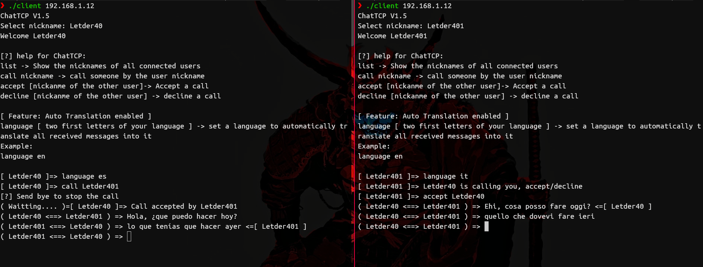
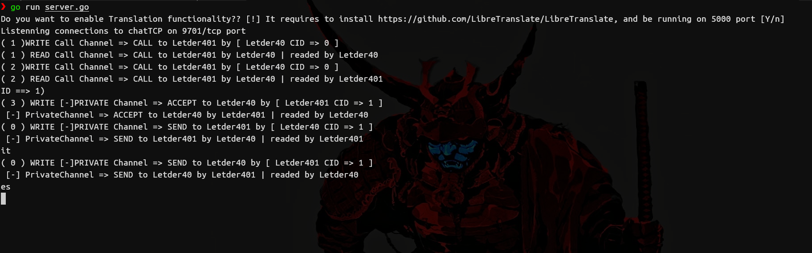

# chatTCP
A chat server / client based on a custom text type protocol over tcp

## Now chatTCP is on 1.5 version
* auto-translation
    * if there is no arguments on the server initialization the translation feature is disabled.
    * run the server with --libre-translate or -lt to run it with libre-translate.
    * run the server with --deepl [api-key] or -dl [api-key] to run it with deep-translate.

* better intterface.
* client is working properly.

## Client Preview

## Server Preview

